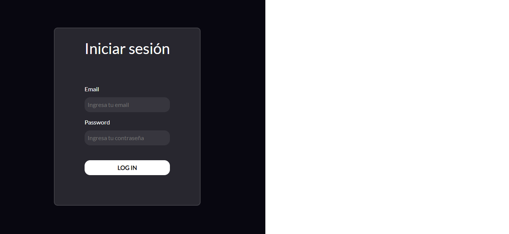
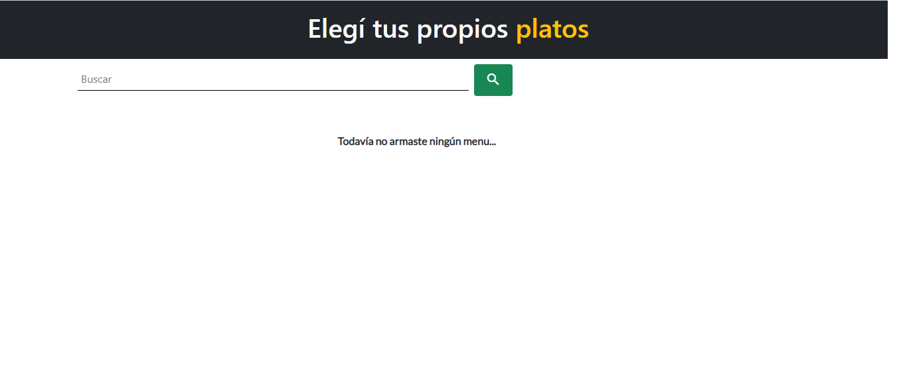
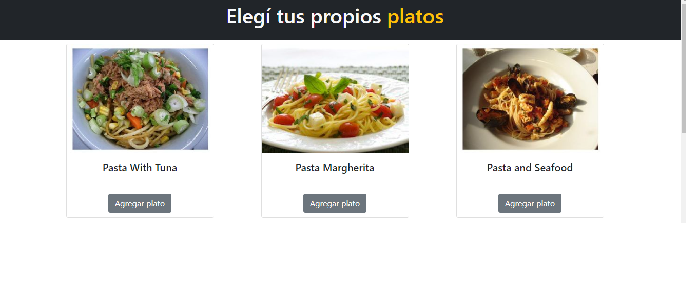
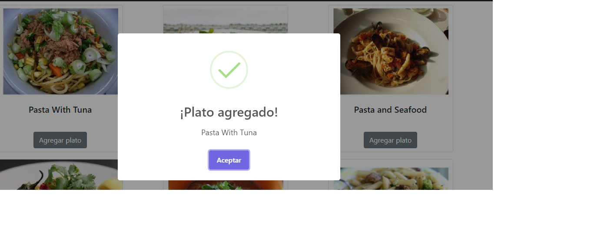
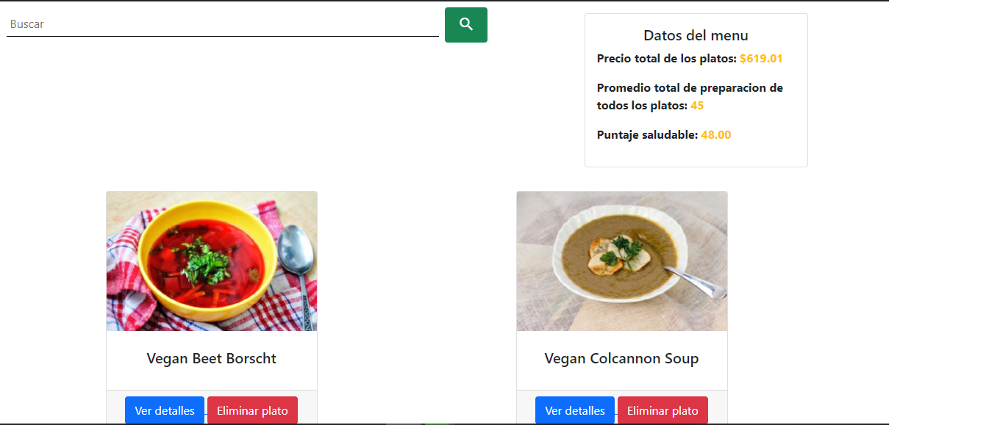
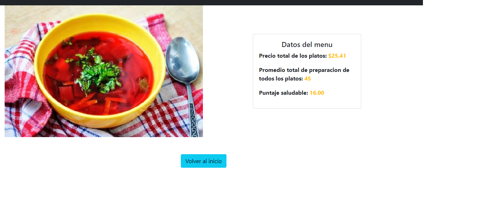

# Desafio de Alkemy
El desafió constaba en realizar un menu de comida. Donde solo debía haber 4 platos, 2 veganos y 2 no veganos. Ademas al ir agregando cada plato, se muestra en pantalla los datos del menu, asi como: **Precio total**, **Promedio total de preparación** y **El puntaje de salud**. Y por ultimo cada plato tenia su detalle, mostrando la foto del plato y sus datos respectivos.

La aplicación tiene 4 secciones: Un **Login** donde para poder ingresar al home o a otra sección te tenes que registrar. Luego tiene un **home** donde se va mostrar el buscador, los platos agregados y los detalles del menu. Va haber una sección donde se muestra todos **los platos buscados** y por ultimo una sección mostrando los **detalles** del plato seleccionado.

